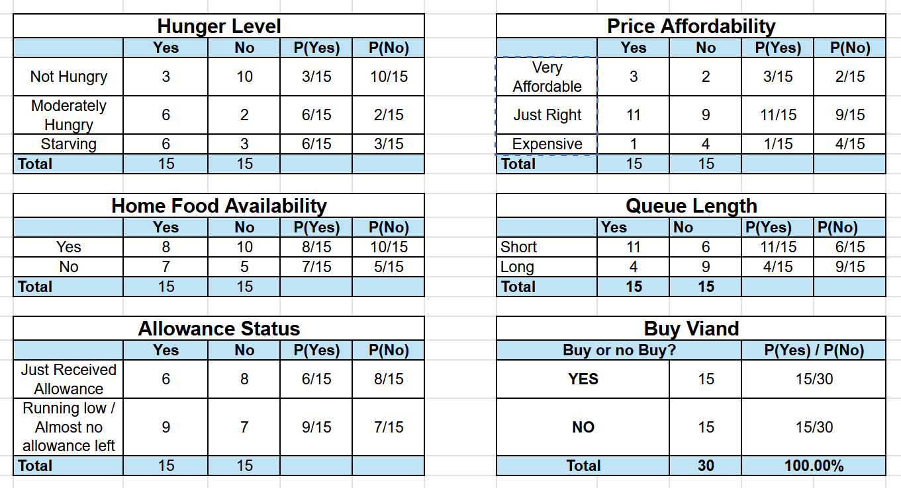
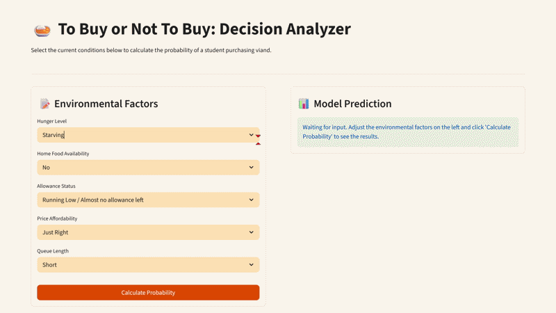
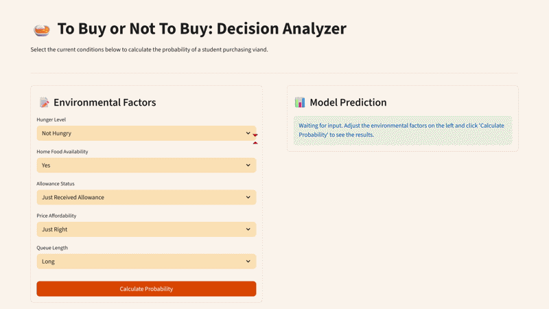

# To Buy or Not To Buy: Decision Analyzer

A laboratory assignment submission for our Computational Science course, implementing a Naive Bayes classifier to predict student purchasing behavior at a carenderia.

## Overview

This application analyzes whether a student will buy viand based on five environmental factors: Hunger Level, Home Food Availability, Allowance Status, Price Affordability, and Queue Length. The model calculates the probability of a "Buy" or "Do Not Buy" decision using a dataset of 30 balanced survey responses.

## The Data

We surveyed respondents about their most recent decisions at a carenderia to gather real-world contingency data, ensuring an equal split of 15 "Yes" and 15 "No" scenarios to prevent model bias.

## The Application

We built a responsive web interface using Python and Streamlit to make the probability calculations interactive and accessible. Below are demonstrations of the application predicting both outcomes based on different environmental inputs.

|                Predicting "Yes" (Buy)                |            Predicting "No" (Do Not Buy)            |
| :--------------------------------------------------: | :------------------------------------------------: |
|  |  |

## How to Run Locally

1. Clone this repository to your local machine.
2. Open your terminal and navigate to the project folder.
3. Install the required dependencies by running:
   `pip install -r requirements.txt`
4. Start the application by running:
   `streamlit run app.py`

## Conclusion

By multiplying the prior probabilities with the conditional likelihoods of each selected factor, this Naive Bayes model successfully demonstrates how multiple independent variables converge to influence a student's final purchasing decision. The web application proves that the underlying algorithm can seamlessly process environmental inputs to deliver normalized percentage predictions in real time.

## Team Members

- Muhammed Shariff U. Sumagka
- Gerard Carl Q. Palma
- Lara Rain B. Fuentes
